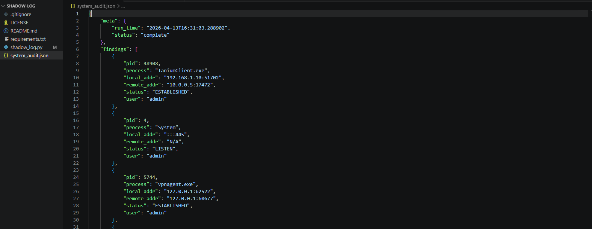

# Shadow-Log
A lightweight Python security auditor for mapping network telemetry to system processes.



### Functionality
- **Process Correlation:** Maps active network sockets to specific PIDs and process names.
- **User Context:** Identifies the system user associated with each network connection.
- **Forensic Export:** Generates structured JSON audit logs for security analysis.

### Getting Started
1. **Install dependencies:**
   ```bash
   pip install psutil
Run the auditor:
(Note: Run with elevated privileges/sudo to capture all system processes)

Bash
python shadow_log.py
Review findings:
Open system_audit.json to view the structured telemetry data.

Project Stack
Language: Python 3.x

Libraries: psutil, json, socket
